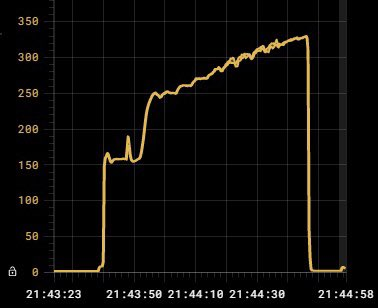
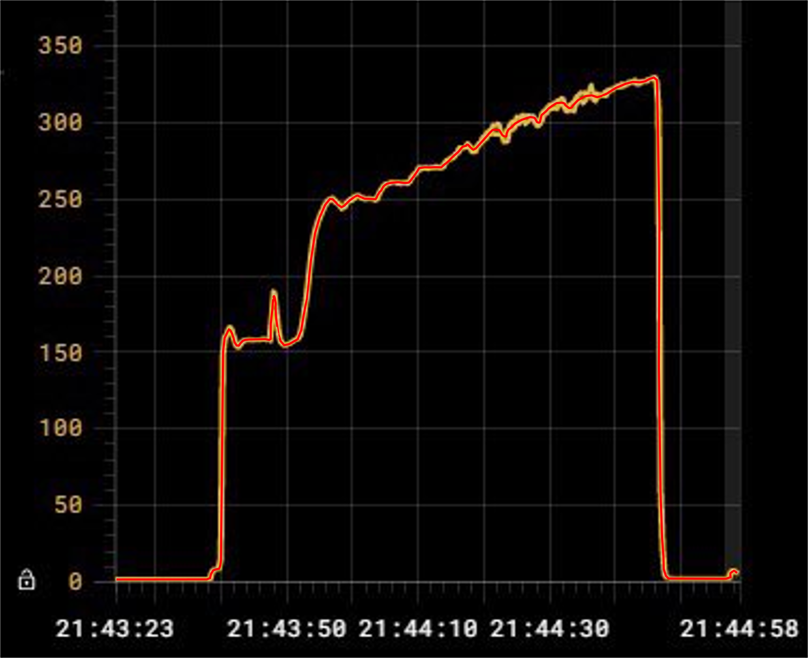
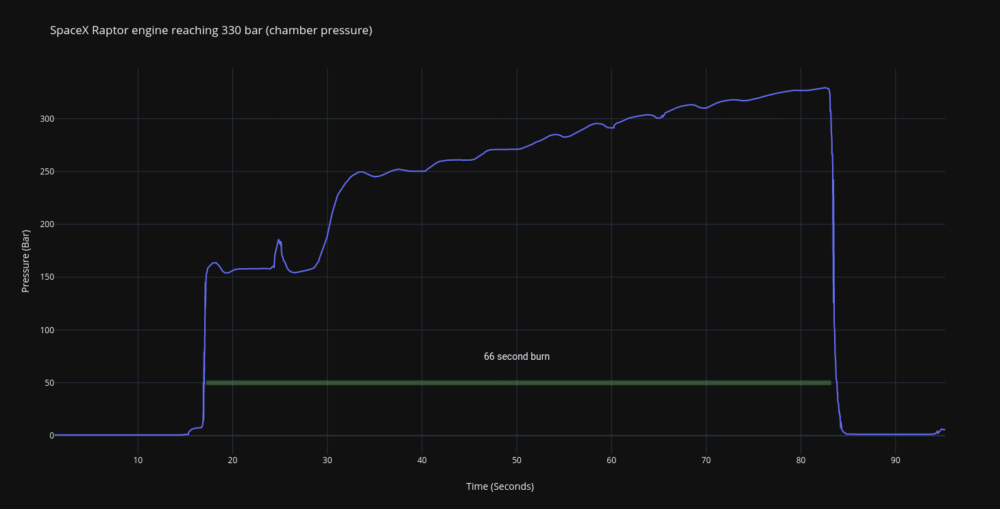

# SpaceX Raptor 330 bar test data

First, I increased the image size by 400%, then manually traced a new (red) line over the existing one for better clarity.

The plot was then digitised using WebPlotDigitizer:
https://automeris.io/WebPlotDigitizer/

After cleaning up the data a bit (removed a few bad points), I imported it into plotly to graph it out:
https://chart-studio.plotly.com/~guyfawcus/1.embed

NOTE: This is best guess without the original data but I'm pretty confident because of the final pressure reading (329.35)

